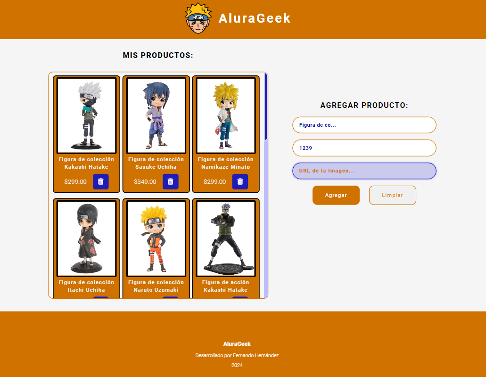

# Alura Geek

<p align="center" >
     
</p>

Este proyecto implementa un CRUD (Crear, Leer, Actualizar, Eliminar) para gestionar productos. Permite agregar nuevos productos con nombre, precio y URL de imagen, así como eliminar productos existentes.

## Tabla de Contenidos

- [Descripción](#descripción)
- [Características](#características)
- [Tecnologías Utilizadas](#tecnologías-utilizadas)
- [Instalación](#instalación)
- [Uso](#uso)

## Descripción

Alura Geek es un proyecto que proporciona una interfaz para agregar y eliminar productos de manera sencilla. Está diseñado para ser utilizado como un panel de administración para manejar inventarios de productos.

## Características

- Interfaz sencilla para agregar productos nuevos
- Funcionalidad para eliminar productos existentes
- Almacenamiento de productos en un archivo JSON (`db.json`)
- Simulación de una API utilizando JSON Server

## Figuras Coleccionables de Naruto

El proyecto se centra en productos relacionados con figuras coleccionables de Naruto. Los usuarios pueden agregar nuevas figuras con detalles como nombre, precio y una URL de imagen que represente el producto.

## Tecnologías Utilizadas

- HTML5
- CSS3
- JavaScript
- [JSON Server](https://github.com/typicode/json-server) para simular la API
- [GitHub Pages](https://pages.github.com/) para el hosting

## Instalación

1. Clona este repositorio:
   ```bash
   git clone https://github.com/fernando-hess/alura-geek.git

2. Navega al directorio del proyecto:

    cd alura-geek

3. Instala JSON Server globalmente (si no lo tienes instalado):

    npm install -g json-server

4. Inicia el servidor JSON:

    json-server --watch db.json

5. Abre index.html en tu navegador para ver la aplicación funcionando.

## Uso

<p align="center" >
     
</p>

Para agregar un nuevo producto, completa los campos de nombre, precio y URL de imagen y haz clic en el botón de agregar.
Para eliminar un producto, haz clic en el botón de eliminar junto al producto que deseas eliminar en la lista.
